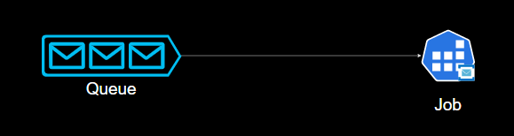
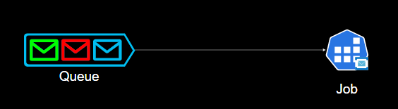

# MinimalQueues


## **1<sup>st</sup> step: Configure a Provider**

### Example for **Aws Sqs**

```csharp
hostBuilder.AddAwsSqsListener(queueUrl: "...the queue url ...", maxConcurrency: 5)
```
### Example for **Azure Service Bus**
```csharp
hostBuilder.AddAzureServiceBusListener(connectionString: "...ServiceBus connection string..", entityPath: "...the entity path...")
```
---
## **2<sup>nd</sup> step: Add the Deserialization Middleware**
```csharp
var queueApp = hostBuilder
        .AddAzureServiceBusListener(/*...*/) // or the provider you want 
        .UseDeserializedMessageHandler();
```
---
## **3<sup>rd</sup> step: Provide a Message Handler delegate**

### **Scenario 1:** Queue with Single Message Type



```csharp
queueApp.Use(async (Dto deserializedMessage) =>
{
    //Code to process the message
});

public class Dto//we want to deserialize to this type
{
    //...
}
```
The parameter passed to the `Use` method must be an async delegate. This async delegate can receive as paramter (order or paramteres does not matter):
- Any Dependency registered in the `IServiceCollection` at app startup
    - For Scoped dependencies: a new scope is created for every message that is received
- A parameter with the `Prop` Attribute
    - These parameters will contain header values.
    - The name of the header must be specified in the `Prop` attribute: `[Prop("header-name")]`
- A `CancellationToken` that cancels when the Host is stopping.
- If the parameter is not any of the previous, the message will be deserialized to this parameter (it is assumed that it is the message body parameter).

The following example receives the four types of parameters.

```csharp
queueApp.Use(async (Dto deserializedMessage, IInjectedService dependency, [Prop("someHeader")] string headerValue, CancellationToken cancellation) =>
{
    //Code to process the message.
});
```

### **Scenario 2:** Queue with Multiple Message Types


The delegate passed to the `When` method can receive any Header or Property, parameter name and type must match the message header name and type.
If the header name does not match the parameter name, use the `Prop` Attribute (as shown in the example below when configuring the blue Handler)

```csharp
queueApp.When((string type)=> type is "green").Use(async (GreenMessage message) =>
{
    //Code to process the message.
});

queueApp.When((string type) => type is "red").Use(async (RedMessage message) =>
{
    //Code to process the message.  
});

queueApp.When(([Prop("type")]string header) => header is "blue").Use(async (BlueMessage message) =>
{
    //Code to process the message.  
});
```
As in the 1<sup>st</sup> Scenario the `Use` method can receive dependencies, headers and the CancellationToken.

---

## **Configure Provider with IConfiguration or any dependency:**
### Example for Aws Sqs:
```csharp
var queueApp = hostBuilder.AddQueueProcessorHostedService()
    .ConfigureAwsSqsListener<IConfiguration>((sqsConfig, configuration) =>
    {//The generic parameter can be anything you want to be injected
        sqsConfig.QueueUrl = configuration["queueUrl"];
        sqsConfig.MaxConcurrentCalls = 5
    })
```

### Example for Azure Service Bus:
```csharp
var queueApp = hostBuilder.AddQueueProcessorHostedService()    
    .ConfigureAzureServiceBusListener<IConfiguration>((serviceBusConfig, configuration) =>
    {//The generic parameter can be anything you want to be injected
        serviceBusConfig.ConnectionString = configuration["sb-connectionString"];
        serviceBusConfig.EntityPath = configuration["entity-path"];
        serviceBusConfig.ServiceBusProcessorOptions = new ServiceBusProcessorOptions {MaxConcurrentCalls = 5};
    })
```
---
## **Configure a Custom Middleware**
Middlewares are added by providing an async delegate.
After Adding the provider (ServiceBus, Sqs, RabbitMQ), and before calling `UseDeserializedMessageHandler()`, call the `Use` method passing as parameter the async delegate middleware:

```csharp
var queueApp = hostBuilder.AddAzureServiceBusListener(/*...*/)
   .Use(async (ILogger<Program> logger, IMessage message, Func<IMessage, Task>? next) =>
    {
        logger.LogInformation(message.GetBody().ToString());
        await next(message);
    })
    .UseDeserializedMessageHandler();
``` 

The async delegate middleware can receive as parameters:
- Any Dependency registered in the `IServiceCollection` at app startup
- An `IMessage` parameter which you can use to read the content and headers of the message.
- A `Func<IMessage, Task>?` which you can use to invoke the next middleware (If this delegate is not invoked the next middleware will not run)
- A `CancellationToken` that cancels when the Host is stopping.